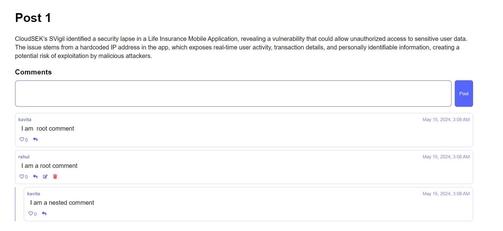
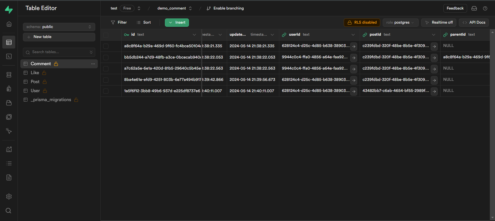

# Post Commenting Service

This application is a post commenting service. Each post can have comments, and these comments can have child comments. Additionally, comments are editable even after they have been posted.

## Installation Process

Follow the steps below to set up the application:

1. **Client Setup**:
    - Navigate to the client folder.
    - Install all the dependencies using the command:
        ```bash
        npm install
        ```
    - Start the client using the command:
        ```bash
        npm start
        ```

2. **Server Setup**:
    - Navigate to the server folder.
    - In the `.env` file, use the Supabase URL for DB storage in PostgreSQL.
    - Run the following commands:
        - To migrate the database using Prisma:
            ```bash
            npx prisma migrate dev
            ```
        - To seed the database:
            ```bash
            npx prisma db seed
            ```
        - To start the server:
            ```bash
            npm run devStart
            ```

## About Prisma Seeding

Prisma's seeding functionality allows you to populate your database with initial or sample data. This can be particularly useful during the development, testing, or initial stages of an application. When you run `npx prisma db seed`, Prisma expects a command in the "seed" key in the "prisma" key of your `package.json` file. This can be any command, and Prisma will just execute it. Seeding can be triggered manually with `prisma db seed`, or automatically in `prisma migrate dev` and `prisma migrate reset`.

## Images

There are two images in the folder that provide a visual representation of the application.



## Note

Please replace the placeholders with your actual data where necessary. Also, ensure that you have Node.js and npm installed on your machine before running these commands.

